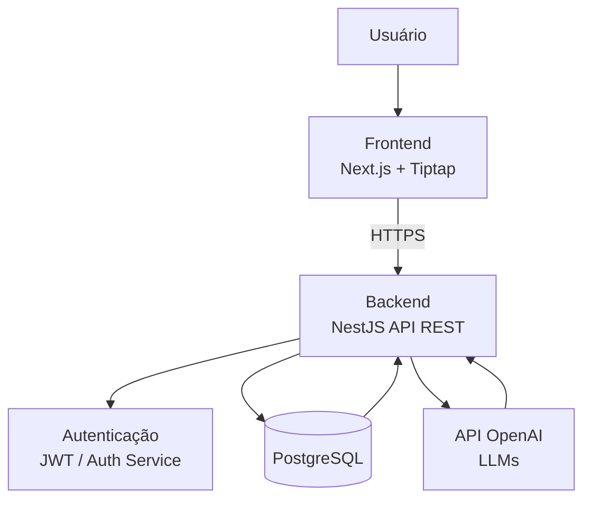
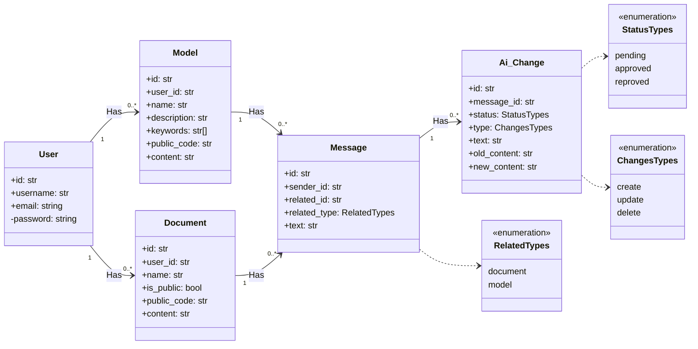

# FlexRelat

**Título do TCC:** FlexRelat: Plataforma Web para criação de relatórios comerciais, apoiada por Inteligência Artificial Generativa.
**Aluno:** Marcus Vinicius Gomes de Oliveira
**Semestre de Defesa:** 2025-2

[PDF do TCC](caminho_do_arquivo)


# TL;DR

**Para rodar:**

Na pasta backend

```$ npm install``` -> Instalar as dependências.

```$ npm run start:dev``` -> Executar o código para desenvolvimento na porta padrão 5000. 

Na pasta frontend

```$ yarn``` -> Instalar as dependências.

```$ yarn dev``` -> Executar o código para desenvolvimento na porta padrão 3000.

# Descrição Geral
A crescente necessidade de agilidade e precisão na execução de atividades complexas e repe- titivas tem impulsionado o uso de tecnologias baseadas em Inteligência Artificial Generativa no cotidiano corporativo. Processos tradicionalmente onerosos, como a elaboração manual de relatórios detalhados, frequentemente enfrentam desafios significativos, incluindo a ocorrência de erros, atrasos na entrega e a exigência de elevado conhecimento técnico especializado. Além disso, a variabilidade na qualidade dos documentos produzidos pode comprometer a tomada de decisões estratégicas e operacionais, evidenciando a necessidade de soluções tecnológicas que simplifiquem e otimizem esses processos.

Propõe-se, portanto, a plataforma web FlexRelat, uma abordagem baseada em Inteligência Artificial Generativa (GenAI), que utiliza Modelos de Linguagem de Larga Escala (LLM) para gerar e editar relatórios personalizados a partir de entradas em linguagem natural, exigindo o mínimo de conhecimento técnico por parte do usuário. A plataforma foi validada por meio de testes funcionais e da coleta de feedbacks de usuários reais, permitindo avaliar desempenho, usabilidade e qualidade das funcionalidades assistidas por inteligência artificial. Com este pro- jeto, busca-se não apenas apresentar uma solução viável para a geração de relatórios assistida por Inteligência Artificial Generativa, mas também contribuir para a compreensão do potencial dessas tecnologias no contexto corporativo, especialmente no que se refere à automação de processos documentais e ao aumento da eficiência operacional.

# Funcionalidades

* **Gestão de Usuário e Acesso**
* **Fazer login:** Autenticação no sistema para acesso às ferramentas.
* **Manter usuário:** Consultar, incluir, alterar e excluir o próprio cadastro na plataforma.


* **Gestão de Documentos e Modelos**
* **Manter documento:** Consultar, incluir, alterar e excluir documentos de texto.
* **Manter modelo:** Consultar, incluir, alterar e excluir modelos (templates) para uso recorrente.
* **Compartilhamento:** Emitir link de compartilhamento para acesso externo.


* **Edição de Estrutura e Componentes**
* **Manter componente:** Consultar, incluir, alterar e excluir componentes específicos dentro de um documento ou modelo.


* **Inteligência Artificial e Sugestões**
* **Manter propostas de alteração por IA:** Consultar, solicitar, aprovar e reprovar propostas geradas automaticamente pela inteligência artificial.
* **Tipos de propostas:** Ações de criação, alteração e remoção de conteúdo tanto em documentos quanto em modelos.


# Arquitetura

Este diagrama apresenta uma visão geral da arquitetura da aplicação. O sistema foi projetada seguindo uma abordagem em três camadas, onde o frontend, desenvolvido em Next.js, é responsável pela interface com o usuário. As interações do frontend ocorrem via requisições HTTPS para o backend, implementado em NestJS, que centraliza as regras de negócio, autenticação, acesso ao banco de dados PostgreSQL e integração com a API de modelos de linguagem. Essa separação facilita o entendimento do fluxo da aplicação, além de contribuir para manutenção, escalabilidade e evolução do projeto. A camada de dados é um banco relacional PostgreSQL.




## Diagrama de classes




# Dependências
> As dependências específicas do frontend e do backend são gerenciadas por gerenciadores de pacotes (yarn e npm), sendo assim é só necessário instalar as dependências desses dois gerenciadores:
* [Node.js](https://nodejs.org)
* [Yarn](https://yarnpkg.com/)
